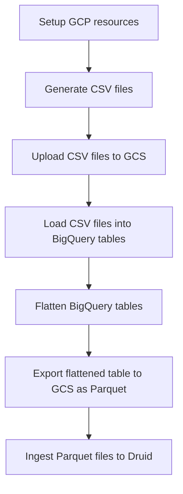

# star-schema-benchmark

Star Schema Benchmark for BigQuery and Apache Druid
This repository contains the scripts to generate the data for the Star Schema Benchmark
and the queries to run on BigQuery and Apache Druid.

Benchmark preparation steps:



## Setup GCP resources

Create GCS bucket:

```bash
gcloud storage buckets create $GCP_BUCKET --location=europe-west1 --default-storage-class=STANDARD --uniform-bucket-level-access
```

Add permissions to the bucket for Druid ingestion service account:

```bash
gcloud storage buckets add-iam-policy-binding $GCP_BUCKET --member=$GCP_DRUID_SA --role=roles/storage.objectViewer
```

Create BigQuery dataset:

```bash
bq mk --data_location=EU $GCP_DATASET
```

To speed-up data loading to GCS create VM in the same region as the GCS bucket:

```bash
gcloud compute instances create $GCP_VM \
  --zone=$GCP_PROJECT_ZONE \
  --machine-type=n4-standard-2 \
  --boot-disk-size=50GB \
  --no-address \
  --subnet=$GCP_PROJECT_SUBNET
```

Check if you can connect to the VM:

```bash
gcloud compute ssh $GCP_VM --zone=$GCP_PROJECT_ZONE --internal-ip
```

## Generate data

Login into VM and install dependencies:

```bash
sudo apt-get update
sudo apt install build-essential git
```

Checkout the repository with data generator:

```bash
git clone https://github.com/electrum/ssb-dbgen.git
```

Compile the generator:

```bash
cd ssb-dbgen
make  
```

For the initial tests generate ~1GB of data.

```bash
./dbgen -f -s 1 -T a
```

Check how many records are in the generated file `wc -l *.tbl`:

```bash
  30000 customer.tbl # 30k
6001171 lineorder.tbl # 6mln
 200000 part.tbl # 200k
   2000 supplier.tbl # 2k
6235727 total
```

It gives ~6mln records, enough to test the queries, but not for benchmarking.

For more realistic benchmarks generate ~30GB of data.
NOTE: Do it separately for each table, as the generator can crash.

```bash
./dbgen -f -s 30 -T l
./dbgen -f -s 30 -T c
./dbgen -f -s 30 -T p
./dbgen -f -s 30 -T s
```

Check the results `wc -l *.tbl`:

```bash
   900000 customer.tbl # 900k
179998372 lineorder.tbl # 180mln
  1000000 part.tbl # 1mln
    60000 supplier.tbl # 60k
181958372 total
```

## Upload data to GCS

Authenticate using your GCP account:

```bash
gcloud auth login
```

With 200MiB/s upload speed it takes ~90 seconds to upload 17.5GiB of data.

```bash
gcloud storage cp *.tbl $GCP_BUCKET
```

## Load data into BigQuery

The `supplier` table:

```shell
bq load \
  --source_format=CSV \
  --ignore_unknown_values=true \
  --field_delimiter="|" \
  --schema=schemas/supplier.json \
  $GCP_DATASET.supplier \
  $GCP_BUCKET/supplier.tbl
```

TODO

## Flatten BigQuery tables

TODO

## Export flattened table to GCS as Parquet

TODO

## Ingest Parquet files to Druid

TODO

## Cleanup

Remove GCS with all the data:

```bash
gcloud storage rm -r $GCP_BUCKET
```

Remove VM:

```bash
gcloud compute instances delete $GCP_VM --zone=europe-west1-b
```
