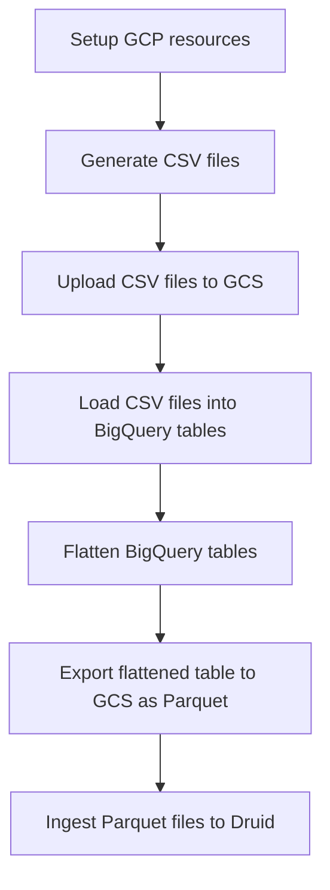
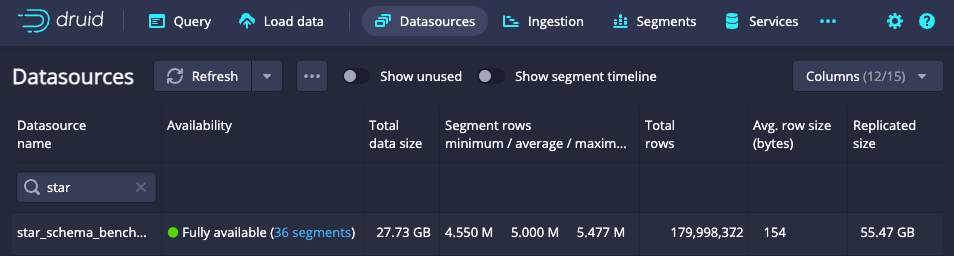

# Star Schema Benchmark

Star Schema Benchmark for BigQuery and Apache Druid.

This repository contains the scripts to generate the data for the [Star Schema Benchmark](https://www.cs.umb.edu/~poneil/StarSchemaB.PDF)
and run the benchmark queries on BigQuery and Apache Druid.

Overview of benchmark preparation steps:



## Configure sensitive data

Use `direnv` and `.envrc` file to store sensitive data:

```bash
export GCP_PROJECT=
export GCP_PROJECT_ZONE=
export GCP_PROJECT_SUBNET=

export GCP_BUCKET=
export GCP_VM=
export GCP_DATASET=
export GCP_DRUID_SA=
export GCP_DRUID_HMAC_KEY=
export GCP_DRUID_HMAC_SECRET=

export DRUID_ROUTER_URL=
export DRUID_BROKER_URL
export DRUID_USER=
export DRUID_PASSWORD=
export DRUID_INPUT=
export DRUID_DATASOURCE=
```

## Setup GCP resources

Create GCS bucket:

```bash
gcloud storage buckets create $GCP_BUCKET \
  --location=europe-west1 --default-storage-class=STANDARD --uniform-bucket-level-access
```

Add permissions to the bucket for Druid ingestion service account:

```bash
gcloud storage buckets add-iam-policy-binding $GCP_BUCKET \
  --member=$GCP_DRUID_SA --role=roles/storage.objectViewer
```

Create BigQuery dataset:

```bash
bq mk --data_location=EU $GCP_DATASET
```

To speed-up data loading to GCS create VM in the same region as the GCS bucket:

```bash
gcloud compute instances create $GCP_VM \
  --zone=$GCP_PROJECT_ZONE \
  --machine-type=n4-standard-2 \
  --boot-disk-size=50GB \
  --no-address \
  --subnet=$GCP_PROJECT_SUBNET
```

Or start instance if exists:

```bash
gcloud compute instances start $GCP_VM --zone=$GCP_PROJECT_ZONE
```

Check if you can connect to the VM:

```bash
gcloud compute ssh $GCP_VM --zone=$GCP_PROJECT_ZONE --internal-ip
```

## Generate data

Login into VM and install dependencies:

```bash
sudo apt-get update
sudo apt install build-essential git
```

Checkout the repository with data generator:

```bash
git clone https://github.com/electrum/ssb-dbgen.git
cd ssb-dbgen
```

Apply the patch to generate dates in YYYY-MM-DD format:

```bash
echo "
diff --git a/dss.h b/dss.h
index 8f78d89..dcbb750 100644
--- a/dss.h
+++ b/dss.h
@@ -517,7 +517,7 @@ int dbg_print(int dt, FILE *tgt, void *data, int len, int eol);

 #ifdef SSBM
 #define  PR_DATE(tgt, yr, mn, dy)      \
-   sprintf(tgt, "19%02d%02d%02d", yr, mn, dy)
+   sprintf(tgt, "19%02d-%02d-%02d", yr, mn, dy)
 #else
 #ifdef MDY_DATE
 #define  PR_DATE(tgt, yr, mn, dy)      \
" | git apply
```

Compile the generator:

```bash
cd ssb-dbgen
make  
```

For the initial tests generate ~1GB of data.

```bash
./dbgen -f -s 1 -T a
```

Check how many records are in the generated file `wc -l *.tbl`:

```bash
  30000 customer.tbl # 30k
6001171 lineorder.tbl # 6mln
 200000 part.tbl # 200k
   2000 supplier.tbl # 2k
6235727 total
```

It gives ~6mln records, enough to test the queries, but not for benchmarking.

For more realistic benchmarks generate ~30GB of data.
NOTE: Do it separately for each table, as the generator can crash.

```bash
./dbgen -f -s 30 -T l
./dbgen -f -s 30 -T c
./dbgen -f -s 30 -T p
./dbgen -f -s 30 -T s
```

Check the results `wc -l *.tbl`:

```bash
   900000 customer.tbl # 900k
179998372 lineorder.tbl # 180mln
  1000000 part.tbl # 1mln
    60000 supplier.tbl # 60k
181958372 total
```

## Upload data to GCS

Authenticate using your GCP account:

```bash
gcloud auth login
```

With 200MiB/s network speed it takes ~90 seconds to upload 17.5GiB of data.

```bash
gcloud storage cp *.tbl $GCP_BUCKET
```

## Load data into BigQuery

The `customer` table:

```shell
bq load \
  --source_format=CSV \
  --ignore_unknown_values=true \
  --field_delimiter="|" \
  --schema=schemas/customer.json \
  $GCP_DATASET.customer \
  $GCP_BUCKET/customer.tbl
```

The `supplier` table:

```shell
bq load \
  --source_format=CSV \
  --ignore_unknown_values=true \
  --field_delimiter="|" \
  --schema=schemas/supplier.json \
  $GCP_DATASET.supplier \
  $GCP_BUCKET/supplier.tbl
```

The `part` table:

```shell
bq load \
  --source_format=CSV \
  --ignore_unknown_values=true \
  --field_delimiter="|" \
  --schema=schemas/part.json \
  $GCP_DATASET.part \
  $GCP_BUCKET/part.tbl
```

The `lineorder` table:

```shell
bq load \
  --source_format=CSV \
  --ignore_unknown_values=true \
  --field_delimiter="|" \
  --schema=schemas/lineorder.json \
  --time_partitioning_type=YEAR \
  --time_partitioning_field=LO_ORDERDATE \
  $GCP_DATASET.lineorder \
  $GCP_BUCKET/lineorder.tbl
```

Check if the tables are loaded correctly:

```shell
bq --dataset_id=$GCP_DATASET query --use_legacy_sql=false \
  "SELECT COUNT(*) FROM customer"
bq --dataset_id=$GCP_DATASET query --use_legacy_sql=false \
  "SELECT COUNT(*) FROM supplier"
bq --dataset_id=$GCP_DATASET query --use_legacy_sql=false \
  "SELECT COUNT(*) FROM part"
bq --dataset_id=$GCP_DATASET query --use_legacy_sql=false \
  "SELECT COUNT(*) FROM lineorder"
```

## Flatten BigQuery tables

```shell
bq --dataset_id=$GCP_DATASET query --use_legacy_sql=false "$(cat schemas/lineorder_flat.sql)"
```

Check if the table is flattened correctly:

```shell
bq --dataset_id=$GCP_DATASET query --use_legacy_sql=false \
  "SELECT COUNT(*) FROM lineorder_flat"
```

## Export flattened table to GCS as Parquet

Extract flattened table to GCS:

```shell
bq extract \
  --destination_format=PARQUET \
  --compression=SNAPPY \
  $GCP_DATASET.lineorder_flat \
  $GCP_BUCKET/lineorder_flat/\*.parquet
```

Check the export, for 180mln records it should be ~19GiB:
    
```shell
gcloud storage ls -l $GCP_BUCKET/lineorder_flat/
```

## Ingest Parquet files to Druid

Don't allow Druid to drop data just after the ingestion due to default cluster policy:

```shell
curl --location --request POST "$DRUID_ROUTER_URL/druid/coordinator/v1/rules/$DRUID_DATASOURCE" \
  --header 'Content-Type: application/json' \
  --user "$DRUID_USER:$DRUID_PASSWORD" \
  --data-raw '[{"type": "loadForever"}]'
```

Start Druid native ingestion process, for 180mln records it takes ~40 minutes:

```bash
envsubst < ingestion/0_baseline.json | \
curl "$DRUID_ROUTER_URL/druid/indexer/v1/task" \
  --header 'Content-Type: application/json' \
  --user "$DRUID_USER:$DRUID_PASSWORD" \
  --data-binary "@-"
```

After ingestion Druid router shows the datasource:



## Run queries

Run simulations for BigQuery and Druid:

```bash
sbt gatling:test
```

## Cleanup

Stop VM:

```bash
gcloud compute instances stop $GCP_VM --zone=europe-west1-b
```

Remove VM:

```bash
gcloud compute instances delete $GCP_VM --zone=europe-west1-b
```
